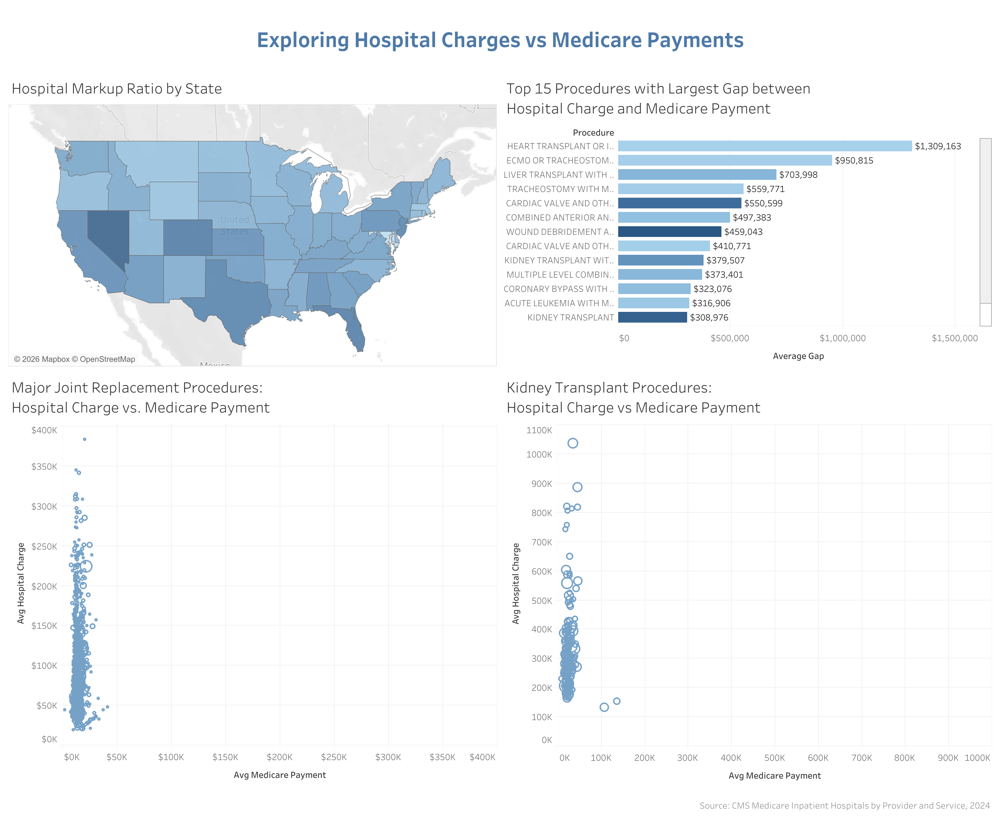

# Hospital Billing Analysis

An exploratory analysis of U.S. hospital billing patterns using Medicare inpatient data from the Centers for Medicare & Medicaid Services (CMS). This project investigates the gap between what hospitals charge and what Medicare actually pays across over 140,000 records from about 3,000 US hospitals and 540 Diagnosis-Related Groups (DRGs). The analysis aims to identify pricing patterns by procedure type, DRG, state, and hospital size.

## Interactive Dashboard

  

[View Dashboard on Tableau Public](https://public.tableau.com/shared/K6NCCJQZJ?:display_count=n&:origin=viz_share_link)

## Key Findings
**1. On average, Medicare paid about 16% of what hospitals charged.** Hospitals billed an average of roughly $92K per Medicare patient, while Medicare paid an average of about $15K, reflecting an overall markup ratio of around 6.09x.

**2. Average markup ratio varies substantially by state, from 10.75x (NV) to 1.21x (MD).** Nevada (10.75x), California (8.72x), and Florida (8.51x) had the highest markup ratios in the US, while Maryland (1.21x) had the lowest.

**3. Markup ratio varies even more dramatically by procedure than by state.** Among fairly common DRGs (present in at least 50 hospitals), Transurethral Prostatectomy without CC/MCC showed the highest markup ratio of 22.54x, meaning Medicare paid $1 for every $22 billed. Based on the dollar amount gap between hospital charge and Medicare payment, a different ranking appeared. CAR T-Cell and Other Immunotherapies had the largest gap at roughly $1.75M. Heart Transplant with CC/MCC, Lung Transplant, and Liver Transplant with MCC were among the top 5 with gaps of around $1.3M, $930K, and $700K, respectively. 

**4. For the same procedure, hospital charges span a 20x range while Medicare payments remain comparitively fixed.** Major Joint Replacements (DRG 470) charges from hospitals range from roughly $19K to over $380K. Medicare payments for this same procedure range from $1700 to roughly $41K. The scatterplot of hospital charge vs Medicare payment [(view here)](https://public.tableau.com/shared/8FSBJCBGF?:display_count=n&:origin=viz_share_link) shows a tall and narrow vertical spread, reflecting that hospitals price the same procedure at very different prices while Medicare reimbursement remains bounded.

## Data Set

**CMS Medicare Inpatient Hospitals by Provider and Service (2024)**

Source: [data.cms.gov](https://data.cms.gov/provider-summary-by-type-of-service/medicare-inpatient-hospitals/medicare-inpatient-hospitals-by-provider-and-service)

## Limitations
- This CMS data only includes Medicare patient billing, and does not include hospital charges or insurance payments from private insurers.
- Only inpatient procedures covered by Medicare are present. Outpatient procedures and non-covered inpatient procedures are excluded.
- No information about quality of care is present in the data used.

## Next Steps
- Add CMS data from previous years (2013-2023) for trend analysis
- Replace static CSV with CMS's Socratic API for live refresh of any updated data
- Join with additional datasets such as CMS Hospital Compare to explore whether higher hospital charges correlate with higher quality of care
- Explore why some DRGs have wide variation between hospital charges and Medicare payments, while other DRGs have a more convergent variation

